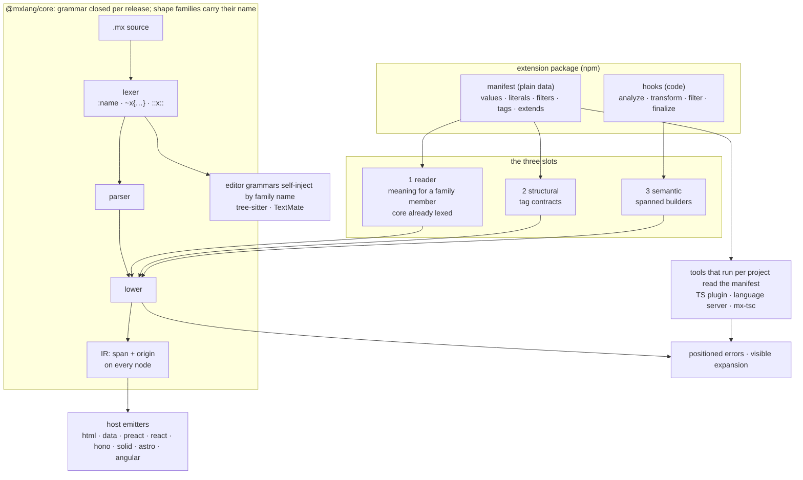

# Language extensions

Status: proposal (decision 182, pending the operator's ruling)

This note answers one question: looking at every extension point MX has today, compiler hooks, contracts, targets, hosts, the editor grammars, what is missing for MX to be the best language to build DSLs and "new" languages in? It inventories the extension points, lays out the layers a language built on MX is made of, uses Mesh as the acceptance test, reads the prior art, and then states a design. Where the design reaches past what the kickoff sketch asked for, block filters, sigil literals, a swappable expression language, open third-party targets, it presents each as an explored option with its cost, what it buys, and a recommendation, and routes the ruling to section 10. Nothing here is decided.

Three languages are in play, and the note keeps them apart. **Marko** is the language MX grew out of and the first framework MX wants to adopt it. **MX** is the language this repository implements. **mxalt** is the name this note uses for any DSL or language built on MX, Mesh being the first. The offer to Marko (decision 172: Marko syntax is an input to nothing here, and sugar such as `:name` is offered, never required) and the **adoption constraint** are different things. The adoption constraint is what MX forces a framework or language designer to accept in order to adopt it, and it applies to Marko, to every framework that writes JSX, and to every framework with a syntax of its own that MX wants to win over. Each mechanism below therefore states two things: what it forces on an adopter, and what it offers an mxalt builder. The design criterion is that the first column stays empty: a framework adopts the pipeline and the families rule, and takes every family and every extension by claim, never by default.

The short version. A language built on MX is layered: a file kind, a target or host, a vocabulary of contracts and hooks, a surface syntax, an expression language, and the tooling projection. MX extends well at the vocabulary layer today and poorly everywhere else. The design keeps the extension mechanism narrow, three slots, a manifest that is plain data, spans by construction, visible expansion, and adds one principle that was missing: the grammar is organized in **shape families**. A family is a syntactic shape core lexes generically, carrying the name that selects its meaning inside the shape (`:name`, `~sql{...}`, `::markdown::`). Extensions fill families; only MX adds families, one grammar release at a time. This is what lets an editor highlight a filter it has never heard of, the way a markdown editor colours a fenced block in a language the markdown grammar never listed. It is also what keeps the adoption constraint empty: a family with no claim on a target lexes, lowers to `mx/unclaimed-<family>` only where it is used, and costs the adopter nothing in its grammar, its runtime or its types.

The diagram is the whole design on one screen. An extension package touches the pipeline only at lowering, and only through the three slots; the manifest is the one thing the static tools read, and they read it without running anything. Shape families are the one place the grammar opens, and they open to MX, not to extensions.



Nothing enters the lexer or the parser from an extension. An extension gives meaning to a member of a family core already lexes; it never adds a shape. Adding a shape is a language change, and section 6 ranks the shapes worth adding.

## 1. What MX can extend today

Everything below is read from source on this worktree. "Static" means a tool learns it by reading files; "code" means a tool has to `require` the user's module to know it.

| Extension point | Changes | Cannot change | Consumer | Static? |
|---|---|---|---|---|
| `HostDeclarations` (`packages/core/src/declarations.ts:84-321`) | Tag dispositions (`inert`/`error`), element vs component, delegated tags, modifier policy (`rejectModifier`/`resolveModifier`, `:191-201`), attribute-method policy, the unnamed tag (`resolveDefaultTag`), `acceptsForeignAttrNames`, `claimsAttributeHash`, `orderAttrs`, `checkBinding` | Grammar, IR kinds, span rules, name sugar | `lower.ts`, `contract-default-tag.ts`, `custom-tags.ts` | No: every member is a function |
| Stateful-tag hooks: `isDelegatedTag`/`resolveDelegatedTag`, `ctx.hoist`, `ctx.bindings.register` | What a host-owned primitive tag lowers to and what it hoists | Which tags exist in the file | `lowerDelegatedTag` (`lower.ts:2941`) | No |
| `CustomTag` contract (`custom-tags.ts:487-514`): `parseOptions`, `attributes`, `attributeTags`, `children` (with `#text` and `"*"`), `parents` (with `#root`, `@name`), `declares`, `defaultTag` | Call-site validation, attribute types (`string|number|boolean|expression|array|function|atom`), atom `values`/`pattern`/`ref`, child cardinality, pattern-named children (decision 147) | The parser, except `text` (the body arrives as one unparsed text node, `:54-55`) and `preserveWhitespace`; `openTagOnly` is deliberately not forwarded | `validateCustomTagCall` (`:1451`), `validateCustomTagParents` (`:1090`), `atom-contracts.ts` | Only `parseOptions`, through `readParseOptions` (`scan.ts:638`), which Babel-reads an object literal and refuses anything else |
| `analyze`/`transform`/`finalize` hooks and `ctx.build.*` | The IR a call expands to; declarations other tags can `ref` | Spans: `ctx.build.delegatedTag(name, children, attributeTags, attrs?)` (`:548-553`) takes no `nameSpan`, and a `finalize` has no node at all | `transformCustomTag` (`:2226-2379`) | No |
| `BUILTIN_CUSTOM_TAGS` (`builtin-tags.ts`) | One entry today, `try`, consulted before the caller's tags | Not open to packages; `rejectShadowedRegistration` rejects a user tag of the same name | `lower.ts` | n/a |
| Discovery: `tags/x.mx`, `x.tag.ts`, `package.json#mx.tags`, `mx.contracts` (`scan.ts:408-575`, precedence `:1404`) | Which names are tags in a package, per host | A template-only tag needs no execution; sidecars and `mx.contracts` modules load through `createRequire` (`:50`, `:559`) | `scanCustomTags` (`:1406`), the TS plugin's `tagsFor`, the language server | Layout and `parseOptions` yes; contracts no |
| `TargetDescriptor` (`core/src/target-descriptor.ts:239-320`, `descriptorVersion: 0`) and `createTargetLookup` (`:760`) | A whole target: declarations, translator, `load()`, file kinds, `builtOn`. A third party's descriptor loads from a package specifier under `mx.target`/`mx.host` (`host-policy.ts:87`), joins the project's lookup (`lookupFor`, `target-registry/src/index.ts:127`), and its host file kinds are routed (`fileKindTarget`, `regionFileKinds`) | The contract is unstable by decision (129/132); a file-kind segment must equal its host name (decision 136); `data` is masked as a selectable base for every tool (`resolveStaged`, `:714-748`), so a third-party host `builtOn: "data"` cannot be selected in editors | `lookupFor`, `regionCompileFor` (`:257`), vite plugin, TS plugin, language server, `mx-tsc` | No: `loadTargetDescriptor` (`target-loader.ts:265`) `require`s the package |
| The IR (`core/src/ir.ts`) | Nothing: it is the contract between core and every emitter. `Expr` is `code` + `shape` + `node` + `span` (`:82-94`), so an expression is text with a position, not a fixed AST | `Expr.node` must be positioned; synthesized nodes carry no span (`ir-spec.md:60-64`); no field records which tag produced a node | `Emitter<Out>` (`emit.ts:37-50`), one required method per kind | n/a |
| Parser port front-end rules (`packages/parser/src/frontend/parse.ts:72-90`, `rules.ts:595-653`) | Adds `MxParseError`s per finished tag | Cannot add tokens, nodes or value forms; `MxShorthand.sigil` is the closed union `"#" | "." | ":"` (`parse.ts:580`) | `FrontEnd.runRules` (`parse.ts:1006-1012`) | Internal until PR 3 |
| Parser port template lexer (`packages/parser/src/template/states/`) | Nothing from outside. The expression scanner (`EXPRESSION.ts`) hard-codes TypeScript's string forms, comments, regex detection and operator table; the concise delimited block (`BEGIN_DELIMITED_HTML_BLOCK.ts:117`) ends at `indent + delimiter` and strips indentation per line | Any token form | Every consumer | n/a |
| `@mxlang/babel` `MxHooks` (`src/mx-hooks.ts`): `parseRegion`, `multipleRootsError`; options `mxRegionCompile`, `mxRegionPositionCheck`, `mxRegionFragment` | Where a region may appear and what text replaces it | Anything inside the template grammar; the returned text is re-parsed as JS | `@mxlang/tsx-bridge`, the region hosts | No |
| Editors: `tree-sitter-mx` `grammar.js` (`atom` and `reserved_atom` externals `:94-95`), `queries/injections.scm` (every injection is `#set! injection.language "typescript"`), VS Code TextMate (`syntaxes/mx.tmLanguage.json` is one `include: text.marko`), Zed `rev` pin | Highlight captures per node type; embedded-language injection per node | The node set and the scope names are compiled or bundled at build time; neither grammar reads a project's manifest. Both can be injected into from outside: tree-sitter takes an `@injection.language` from a captured node's text, VS Code lets any extension `injectTo` a scope the host grammar exposes | Zed, the docs highlighter, VS Code | Static by nature; open only through injection |
| TS plugin / `mx-tsc` / language server | Typing of `.mx` through the Volar projection; `atomSplices` already types `x=:foo` as `"foo"` (`core.ts:748`); `TranslateError.errors` fans out (`diagnose.ts:464`) | `TranslateError` carries no `code`, origin, or end position (`core.ts:71-129`); the language server ignores `spans` and reports a one-character range (`diagnose.ts:482`); programmatic `customTags` never reach the language server | Editors, CI | Contracts: no. File kinds: yes, from the project's lookup |
| Vite plugin | Build-time diagnostics shaped as Vite errors (`relabelBuildErrors`) | Nothing about the language | Vite | n/a |

Four facts fall out of the table and shape the rest of the note.

1. **No generic shape rule exists.** Each sigil is hard-coded: `:name` as an atom (`lexAtom`, `EXPRESSION.ts:897`, lexed only where `expression.atoms` is on), `::name` reserved, `:` in a tag name and `:name` between attributes as the 146 sugar, `:=`, `#`/`.` tag-adjacent shorthands, `@name`, `${`, `...`, `/var`. Adding a value form today touches six places: the lexer hunk and its patch lockstep with the installed `htmljs-parser`, the `Options` handler, the front-end node and `ast.md`, the `read()` stand-in, the core converter (`atoms.ts`), and the stock-parser probe. A language that wants one more shape pays all six, and the editor grammars pay a release on top.
2. **Tooling learns almost nothing without running code.** Only tag layout and `parseOptions` are read statically. Every contract, every sidecar hook, every `mx.contracts` module, and every target descriptor is loaded through a synchronous `require`, which is why Node ESM edits need a tool restart (`sync-esm-reload-node`) and why an `mx.contracts` module may hold an `analyze` function the editor must execute to get a diagnostic.
3. **Synthesized nodes have no provenance and no spans.** The builder API has no place to put a span, so `@mxlang/data` rejects a transform's output as a broken invariant (`build.ts:110-118`, `:431`), and no IR field says which tag produced a node, so a diagnostic cannot name the extension that caused it.
4. **A third-party target is possible and not supportable.** The loading path exists and the lookup honours it, but `descriptorVersion: 0` is unstable by decision, loading is a `require`, and the hostless base a DSL wants (`data`) is masked in every tool. A language that is a target today runs on a contract MX reserves the right to break.

## 2. The layers of a language built on MX

A "new language" on MX is not one thing. It is a stack, and each layer has its own extension point, or lacks one. Naming them separately is what turns "is MX extensible?" into a list of concrete gaps.

| Layer | What it decides | Today | Missing | Size |
|---|---|---|---|---|
| **File kind** (`.mesh.mx`) | Which pipeline a file enters; which editor mode opens | A host's `fileKinds`, built-in or loaded from a package specifier; segment equals host name (136) | A stable descriptor contract; `data` as a selectable base in tools (`resolveStaged`); a file kind owned by a hostless target | M |
| **Target or host** | What the IR becomes; dispositions; the runtime | `TargetDescriptor` with `builtOn`; eight built-ins | Stabilizing `descriptorVersion`; a statically readable descriptor head (name, host, file kinds, bundled extensions) so tools need not `require` it | M |
| **Vocabulary** (contracts, hooks) | Which tags exist, what they accept, what they expand to | `CustomTag`, `mx.contracts`, `tags/`, sidecars; `analyze`/`transform`/`finalize` | Static manifest; spans on builders; `origin`; `attributeTags["*"]`; conflict rules; `extends` | M (sections 5 and 8) |
| **Surface syntax** (shape families) | Which value and block forms exist in the template layer | One family, sigil values, with one member (`:`) hard-coded | Generic lexing per family; the families themselves: sigil literals, block filters, modifier claims (section 6) | S each in the port, L after the freeze |
| **Expression language** | What `${...}`, attribute values, tag params and `<const/x=...>` are written in | TypeScript, hard-coded in the scanner and in the projection | Nothing for extensions, by design (section 6, rung 5); a per-file-kind scanner profile for a whole-language swap (section 7.5) | L |
| **Tooling projection** | What TypeScript sees; completions; diagnostics | Volar projection for template kinds; `atomSplices`; `atomCandidates` unused | Type from a claim (`ValueClaim.type`); codes, origin and ranges on errors; data-target dispatch (deferred by the operator) | M |
| **Editor grammars** | Highlighting, folding, injection | tree-sitter and TextMate, built per release, no per-project input | Families that carry their name so both grammars self-inject without a manifest (section 6) | S per family, with the family |

The vocabulary layer is the only one that is extensible in the sense a DSL author needs, and even there a tool cannot read the vocabulary without executing it. The rest of this note works down the table.

### 2.1 Marko, MX and mxalt: what is forced and what is offered

The layers above are the mxalt builder's view. The adopter's view is the same stack read the other way: which layers a framework must take whole, which it may shape, and which it may ignore. Three parties sit on it.

| Party | Who | Takes from MX | May shape | May leave off |
|---|---|---|---|---|
| **Marko** (and any framework MX wants to win over: JSX frameworks, frameworks with their own syntax) | A framework author adopting MX as their template language, or taking sugar back into their own | The template layer: tag forms, concise mode, `<if>`/`<for>`/`<define>`, the IR, the lowering rules | Dispositions, delegated tags, modifiers, event spelling, the emitter: everything `HostDeclarations` and `Emitter<Out>` already let a host decide | Every family (no claim on their target means no meaning), every extension (none is bundled unless the descriptor lists it), every mxalt file kind |
| **MX** | This repository | — | The families, the sigil set, the expression language, the manifest contract, the error vocabulary | — |
| **mxalt** (Mesh, a form DSL, a config language) | A DSL or language author building on MX, usually on `data` or on one host | The template layer and one target or host, plus the families MX ships | Vocabulary (contracts, hooks), claims in every family, a file kind of its own, bundled extensions, the tooling projection through a loaded descriptor | The expression language is not theirs to change (section 6, rung 5); nor are the families (the families rule, section 5.1) |

Two consequences follow for the design. First, nothing in sections 5 to 7 may be a precondition for adopting MX: a host that claims no family, bundles no extension and reads no manifest is a complete MX host, and compiles every `.mx` file that uses no claimed member. Second, what MX forces on a framework is exactly the template layer and the IR, which are the things decision 172 already fixed as MX's own; the mechanisms this note adds all live behind a claim. The rows below keep that line, and section 9 item 10 records where an earlier draft crossed it.

## 3. Mesh as the acceptance test

Mesh is an Ash-style resource language on the data target. Its plan lists four needs, in its own order of importance: expressions as a span-accurate TypeScript AST rather than opaque strings; a static tree with spans; tag contracts (allowed children, required attributes, types); and data-only tags. Its open asks are more specific. Each is answered against today's source, then against this design.

**A contract that accepts any child name, or a name pattern, under a parent.** Answered for plain children: `children["*"]` (decision 147, `custom-tags.ts:121-155`) takes an optional anchored regex `pattern` and either a `contract` reference or an inline contract, tried in declaration order, with explicit names winning and the authored spelling kept in `alias`. `defaultTag` was never the route: it only decides what the unnamed tag stands for (`contract-default-tag.ts`). Not answered for attribute tags: `attributeTags` is a plain `Record<string, CustomTagAttributeTag>` with no `"*"` entry, so `<@on_create>`, `<@on_update>` under a Mesh `hooks` tag cannot be declared by pattern. Section 8 sizes that gap as small.

**Transform output that survives `parseData`.** Not answered today. `data-transform-output-tree` is pinned by `unknown-tags.test.ts:466-494` as an `internal error:` diagnostic, and the docs still say `parseData` throws, which the code no longer does. The cause is structural: `ctx.build.delegatedTag` has nowhere to accept a span, and a `finalize` runs with no node. The design fixes it at the builder (section 5.4).

**Multi-error diagnostics.** Partly answered. `TranslateError.errors` (decision 162) carries several contract errors, `parseData` flattens them and never throws, and the parser port's front end returns partial trees with several rule errors. Still single-error: the template lexer stops at its first error (ruling Q20 (a), decision 163), and `parseData` returns `tree: undefined` whenever any diagnostic is an error, so an editor gets no tree from a file with one bad attribute. This note does not reopen 163; it does ask for a partial tree on contract errors (section 8).

**Editor diagnostics for the data target.** Not answered, and deliberately deferred by the operator (`data-target-tooling-dispatch`). The design adds nothing to it: a data-target file reaches the editor through the same `TargetDescriptor.load()` path every host uses once `resolveStaged` stops masking `data`. What this note does require is that nothing in the extension design makes that harder, which is why the manifest is data and the hooks are the existing descriptor mechanism.

**Expressions as a typed AST.** `DataExpr` already carries `code`, `span` and `node: Expression | null` (`targets/data/src/tree.ts:35-41`), a Babel node positioned against the file, and `Expr.atoms` lists the atoms inside it. What Mesh wants beyond that is TypeScript's view of the expression, which is the TS plugin's projection and not an extension slot. It arrives with data-target tooling dispatch, not with this proposal.

**A file kind of its own.** Mesh files are `.mx` on `mx.target: "data"`. A `.mesh.mx` kind would need Mesh to be a host (136) built on `data`, which the loading path allows and `resolveStaged` masks. This is the third-party-target gap of section 2, and it is Mesh's only ask that the vocabulary layer cannot answer.

So Mesh's acceptance test for this note is: pattern-named attribute tags, spanned transform output with provenance, a partial tree under contract errors, diagnostics an agent can act on, and a path to its own file kind. Everything else it needs is either done or belongs to the deferred dispatch work.

## 4. Prior art, and the choice each one changes

Every item here moved a decision in section 5 or 6. Items that only confirmed a choice are omitted.

- **Spark (Ash's DSL framework).** Spark exposes forty-four extension points, from sections and entities through transformers, persisters and verifiers. The documented pain is duck-typed callbacks, unchecked cross-extension writes, implicit transformer ordering, compile deadlocks, and verifier errors reported as warnings. Mesh's own synthesis of Spark concludes "one typed manifest per extension declares which points it uses" and extensions contribute to each other only through declared contributions. This sets the manifest-first shape, the explicit `extends` contribution (section 5.6) in place of the "entries replace, they do not merge" rule that `mx.contracts` has today, and the rule that a verifier failure is an error, never a warning.
- **Racket `#lang` and reader extensions.** A Racket module can replace its own reader, which is the most powerful form of language extension and also why no editor follows it without running the reader. That is the sense in which, for a reader extension, tooling equals runtime: nothing can know the file's syntax without executing the module that defines it. MX is not in that category and this note keeps it out: `mx-tsc`, the TypeScript plugin, the language server, tree-sitter and TextMate each lex a `.mx` file without running any user code, and the families rule exists so that an extension never changes that. MX takes the opposite side: an extension never touches the reader (section 5.1), because the editor grammars work from the grammar alone. Racket also contributes the one good idea: the file's language is stated in a statically visible place. MX puts that statement in the nearest `package.json`, not in the file, because `.mx` files never declare their dialect (section 5.8).
- **Elixir sigils.** `~r/.../`, `~s(...)`, `~D[...]`: one lexer rule reads `~` + name + any of a fixed delimiter set + raw contents + optional modifier letters, and `sigil_r/2` gives the name a meaning. The lexer never knows which sigils exist; the name is inside the shape. This is the model for the sigil-literal family (section 6, rung 2) and for the families principle itself: the shape carries its selector.
- **Pug filters.** `:markdown` followed by an indented block hands the block's text to a named filter at compile time, and the filter's output is spliced back as HTML. Editors colour the block by the filter name. This is the operator's wish and the block-filter family (section 7.3). Pug's lesson is the cost: a filter's errors point at the filter's own line numbers, not the template's, because Pug kept no offset map. MX's version has to keep one.
- **Markdown fences, tree-sitter and VS Code injection grammars.** A fenced block carries its language name in the fence line. tree-sitter-markdown injects by capturing that name as `@injection.language`, so a Markdown grammar built years ago colours a language it never heard of. VS Code's `contributes.grammars` lets any extension `injectTo` a scope the host grammar exposes, which is how a mermaid extension colours fences the markdown grammar never listed. Both mechanisms need only that the host grammar leave the name and the body as distinct nodes or scopes. This is why a family that carries its name is enough for editors, and why no manifest has to reach a grammar.
- **Rust procedural macros.** Crate-scoped through `Cargo.toml`, run as code, opaque to tooling: rust-analyzer has to run a proc-macro server to expand them and still cannot explain them. Two choices come from this. Scope is per package, not per file: Cargo-style scoping works and nobody asks for lexical macro imports. And a tool must never need to execute a hook to learn structure, position, or a type: everything the editor needs is in the manifest. Rust's `Span` discipline, where every synthesized token has a span and `call_site()` is the default, is the model for section 5.4.
- **Terra and Lua staged metaprogramming.** Full compile-time access to the host language. Rejected outright: a `.mx` file never runs code at compile time, and an extension's hooks run with contract-validated calls, never with the file. This is the line that keeps "MX is a language, not a tool" true.
- **Babel and SWC plugins.** Visitor-based transforms over the whole AST, with ordering by plugin list and no manifest, so two plugins that touch the same node interact silently. SWC's answer was to sandbox plugins in wasm, which fixes crashes and not semantics. MX gives an extension no visitor and no tree: a hook receives one validated call and returns IR for it (today's `transform`), and two extensions that claim the same name are a positioned error, not an order (section 5.5).
- **Lisp reader macros.** A global, mutable readtable, order-dependent and invisible. This is the argument against any global registry, including a process-wide `registerExtension()`: the active set is a function of the file's package and nothing else.
- **Sweet.js.** Hygienic macros for JavaScript, technically sound, abandoned because no editor, linter or type checker could see through an expansion. The lesson is visible expansion: a synthesized node names its origin (section 5.4), a diagnostic names the extension that raised it, and `mx-tsc` can print a per-node trace.
- **Language workbenches: MPS, Xtext, Spoofax.** Each generates the editor from the grammar, so a language extension is a grammar extension and the tooling follows. MX cannot regenerate tree-sitter per project, which is why extensions work one layer up, at meaning, and the grammar grows only by release. Spoofax's treatment of errors as a first-class language artifact, with codes and positions as part of the definition, is the model for section 5.7's diagnostic shape.
- **Langium.** A declarative grammar from which the language server is generated, and scoping as a configurable service rather than user code. MX already has the seed: `declares` and `ref` on contracts (decision 156) make name resolution a core service that extensions configure. The design keeps it that way and refuses a `resolve` hook.
- **tree-sitter.** The grammar is compiled at build time and the node set is fixed. Any extension model where a package can add a token form is a model where highlighting lies. This closes the family set at the language level, and it is why every grammar change this note discusses is generic: one node per family, never one node per meaning.

## 5. The design

### 5.1 Three slots, and the families rule

An extension can do exactly three kinds of thing.

- **Reader: claim a member of a shape family.** Core lexes each family generically: `<sigil><name>` in expression position for every sigil in a closed set; and, if the operator adds them, `~name{...}` literals and `::name::` blocks. The lexer produces one opaque spanned node per family carrying the name. An extension gives a name in a family a meaning on a target: what it lowers to, what TypeScript sees, which contract checks apply. It cannot add a sigil, a family, or a delimiter. Today the only family is sigil values, with `:` claimed by atoms and `::` reserved.
- **Structural: declare tags.** Contracts as they exist: `attributes`, `attributeTags`, `children` with `#text` and `"*"`, `parents`, `declares`, `parseOptions`, `defaultTag`. This is `CustomTag` without `transform`/`finalize`, which is also what an `mx.contracts` module may hold today.
- **Semantic: lower or transform.** `analyze`, `transform`, `finalize`, and `filter` for a block filter, with one change: every builder takes a span, and every synthesized node carries its origin.

There is no fourth slot. In particular there is no grammar slot for extensions (no new tokens, tag forms or attribute syntax), no visitor slot (no access to the tree), no resolve slot (name resolution is core's `declares`/`ref` service), and no region slot (the `MxHooks` in `@mxlang/babel` are a host's seam, not an extension's).

The families rule is the design's one hard rule, stated once: **extensions fill families, MX adds families, and no family is forced on an adopter.** The third clause is the adoption constraint from section 2.1 made concrete: a family's members mean nothing on a target that claims none of them, so a host adopts the family's syntax only by claiming into it, and an unclaimed member is an error at the use site, never a grammar the host had to implement. A family is a shape whose selector is inside the shape, so that a lexer that knows the family and nothing else can produce a node with the name, a tree-sitter query can capture the name as `@injection.language`, a TextMate grammar can leave a scope on the body for another extension to `injectTo`, and lowering can look the name up in the active manifests and raise `mx/unclaimed-<family>` at the span when nothing claims it. A shape without a selector inside it (a bare new operator, a new tag-open character, a new placeholder delimiter) is not a family; it is a language decision with no extension story, and section 6 says so for each.

### 5.2 The manifest

An extension is an npm package whose `package.json` names a manifest module under `mx.extension`. The manifest's default export is an object literal. Core reads it the way `readParseOptions` reads a sidecar today, generalized: Babel parses the module, follows identifiers bound once to a literal, reads through `satisfies` and `as const`, and reports a positioned diagnostic for anything it cannot read without running code (a spread of an import, a call, a conditional). Function-valued members are allowed in the literal; a static reader records that they exist and skips them, and only the compiler `require`s the module to call them.

```ts
import type { Extension } from "@mxlang/core";

export default {
  extensionVersion: 0,
  name: "@mesh/resource",
  requires: ["@mxlang/data"],
  values: {
    ":": { kind: "atom" },
  },
  tags: {
    resource: { parents: ["#root"], children: { attributes: {}, actions: {} } },
    attributes: { parents: ["resource"], children: { "*": { contract: "attribute" } } },
    attribute: {
      attributes: { type: { type: "atom", values: ["string", "integer", "uuid"] } },
    },
  },
  extends: {
    "@mesh/core": { resource: { children: { policies: {} } } },
  },
} satisfies Extension;
```

The types, in the shape core would export. `literals` and `filters` are present only if the operator adds those families (section 6); they are shown so the manifest's shape is judged whole.

```ts
export interface Extension {
  extensionVersion: 0;
  /** The package name; used in diagnostics, origins and conflict reports. */
  name: string;
  /** Extensions and targets this one needs active in the same package. */
  requires?: string[];
  /** Reader slot, sigil-value family: meaning for a sigil core already lexes. */
  values?: Partial<Record<Sigil, ValueClaim>>;
  /** Reader slot, sigil-literal family (section 6, rung 2): `~sql{...}`. */
  literals?: Record<string, LiteralClaim>;
  /** Reader + semantic slots, block-filter family (section 7.3): `::markdown::`. */
  filters?: Record<string, FilterClaim>;
  /** Structural and semantic slots: today's CustomTag, hooks included. */
  tags?: Record<string, CustomTag>;
  /** Declared contributions to another extension's tags; merged, conflicts are errors. */
  extends?: Record<string, Record<string, ContractPatch>>;
}

/** Closed by core. Adding a member is a language change with a grammar release. */
export type Sigil = ":";

export interface ValueClaim {
  /** The name the IR, the data tree and diagnostics use for this value kind. */
  kind: string;
  /** What TypeScript sees: the name as a string literal type, or a declared type. */
  type?: "literal" | { from: string; export: string };
  /** What the value lowers to on a host; "reject" makes it a positioned error there. */
  lower?: "string-literal" | "reject";
  /** The attribute-contract fields this kind accepts, by name. */
  contract?: string[];
}

export interface LiteralClaim {
  /** What TypeScript sees: a tagged template `sql\`...\`` from a declared tag, or a declared type. */
  type: { from: string; export: string; as: "tag" | "type" };
  /** Optional: validate the raw text at compile time; errors are positioned inside the literal. */
  check?(raw: string, call: LiteralCall, ctx: AnalyzeContext): void;
}

export interface FilterClaim {
  /** Attributes accepted on the open line, same shape as a tag's. */
  attributes?: CustomTag["attributes"];
  /** The body: raw text (default) or MX that core parses before the hook sees it. */
  body?: "text" | "mx";
  /** Turns the body into IR. `ctx.build.fragment(text, { from, map })` re-enters the parser with an offset map. */
  filter(body: FilterBody, call: FilterCall, ctx: TransformContext): Node[];
}

/** The subset of CustomTag a contribution may add: declarative keys only. */
export type ContractPatch = Pick<
  CustomTag,
  "attributes" | "attributeTags" | "children" | "parents" | "declares"
>;
```

`CustomTag` is unchanged except for `attributeTags["*"]` (section 8, gap 5). `ValueClaim.kind: "atom"` with `contract: ["values", "pattern", "ref"]` is exactly what `type: "atom"` means today. The point of the shape is not that it is new but that every field an editor needs is a literal; `filter` and `check` are the only members a tool skips.

### 5.3 Ownership

| Owner | Owns | Never owns |
|---|---|---|
| Core | The grammar, including every family and its node; the IR; the manifest reader; contract validation; the `declares`/`ref` scope service; the span and origin invariants; diagnostic shape | Any target's meaning for a family member; any tag vocabulary beyond `try` |
| Target or host | Its `HostDeclarations`; which claims apply on it (a descriptor may bundle extensions); the emitter; its file kinds | The grammar; contract semantics |
| Extension | Value, literal and filter claims, tag contracts, contributions, hooks | The grammar; the IR; other extensions' tags, except through `extends` |

The one ownership change from today is that a target descriptor may list `extensions` it bundles, so `@mxlang/data` can ship `:` as an atom without every consumer naming it. Core ships the atom claim itself as a built-in extension, for the reason section 7.1 gives.

### 5.4 Spans and provenance by construction

Two IR changes, both additive.

Every `ctx.build.*` function takes a `from` argument: a node or a `SourceSpan`. A transform passes the call it is expanding; a `finalize` passes the span of the tag unit's registration (the sidecar's `export default` or the manifest entry), because that is the authored place the synthesis comes from. A builder with no `from` does not type-check. `ctx.build.delegatedTag` gains `nameSpan` and `span` from it, so the data target's `requiredSpan` invariant holds for synthesized nodes and `data-transform-output-tree` closes.

Every node a hook produces carries `origin: { extension: string; tag: string; at: SourceSpan }`. Authored nodes have no `origin`. The field is what makes expansion visible: a diagnostic raised on a synthesized node names the extension and the tag that produced it; `mx-tsc --trace` can print one line per synthesized node; the data tree exposes `origin` next to `alias`. This is the Sweet.js lesson and the Rust `Span::call_site()` discipline together.

A block filter needs a third thing: a hook that produces text, not IR, still has to yield positioned nodes. `ctx.build.fragment(text, { from, map })` re-enters `parseFragment` on the produced text with an offset map from produced positions to authored ones; a diagnostic inside the fragment is reported at the mapped authored span when the map covers it, and at the filter's open line, with `origin`, when it does not. Without the map, every error in a filtered block points at the `::markdown::` line, which is Pug's failure mode.

### 5.5 Scoping and conflicts

The active extension set for a file is a pure function of its nearest `package.json`: the union of `mx.extensions` entries, the extensions bundled by the resolved target, and the file-layout tags under `tags/`. It is resolved the way `mx.target` is resolved today (`host-policy.ts:10-38`), in the same place, with the same diagnostics positioned in `package.json`. No file-level import, no process-wide registry, no environment variable.

Conflicts are positioned errors, never an order:

- Two active extensions declare the same tag name, or claim the same family member on the same target: an error at the second `mx.extensions` entry, naming both packages and the name. There is no "first wins" and no "last wins". `mx.contracts`'s present replace-and-warn rule is retired for extensions.
- An extension's `extends` touches a key its target extension already declares: an error, with both spans.
- A local `tags/x.mx` shadows an extension's tag: an error, not the present warning, because a dialect whose rule can be silently dropped by a stray file is not a dialect.
- A `requires` entry that is not active: an error at the manifest.
- A family member nothing active claims: `mx/unclaimed-sigil`, `mx/unclaimed-literal`, `mx/unclaimed-filter` at the member's span, naming the packages in the project that could claim it when the reader can find one.

Resolution order inside a file does not change: wildcard claim, dispositions, structural tags, built-ins, local bindings, registered tags, delegated tags, then elements and components (`lowerAuthoredTag`).

### 5.6 Composition

Extensions compose through two declared channels only. `requires` orders activation and lets a manifest assume another's tags exist. `extends` adds declarative keys to another extension's contract, merged key by key, with any overlap an error. This replaces the Spark pattern of an extension writing into another's entity at transform time, and the `mx.contracts` pattern of "compose the final contract in your generator". A contribution may add a child, an attribute, a parent or a declaration; it may not remove one, change a type, or add a hook. An extension that needs more than that is not extending another; it is replacing it, and should ship its own tag.

### 5.7 How tooling learns without executing

Two kinds of tool, two answers.

Tools that run per project (the TS plugin, the language server, `mx-tsc`, the Vite plugin) read, and never `require`:

- `package.json#mx.extensions` and the resolved target's bundled list.
- Each manifest's literal, through the generalized static reader.
- The resolved contract map, which is the merge of `tags` and `extends` across the active set, with conflicts as positioned diagnostics.
- The claims, which give the TS plugin the type of every family member and the language server its completion candidates (`atomCandidates` exists; nothing consumes it yet).

Editor grammars (tree-sitter, TextMate) run with no project and read nothing. They work because every family carries its name: tree-sitter captures `(sigil_literal name: (_) @injection.language body: (_) @injection.content)` and `(filter_block name: (_) @injection.language body: (_) @injection.content)`, so a `::markdown::` block is parsed by the editor's markdown grammar with no MX involvement; the TextMate grammar leaves `meta.embedded.block.mx-filter` (and the name as a scope) on the body, so a filter package that wants VS Code colouring ships an injection grammar targeting that scope, exactly as the mermaid extension does for markdown fences. An unclaimed name highlights as its named language, if the editor has one, and lowering reports it; highlighting never depends on the project being right.

The compiler additionally `require`s each manifest module to obtain its hooks. The split is the one Rust and VS Code `contributes` both arrived at: static declarations for the tools, code for the build.

Diagnostics change shape to match. `TranslateError` gains `code` (a stable string such as `mx/unclaimed-sigil`, `mx/child-not-allowed`, `mx/tag-conflict`), `origin` (the extension name, when one raised or caused it), and `end`, so the language server stops emitting one-character ranges and uses `spans`. Codes are what an agent keys on and what a `// mx-ignore` would someday name; an extension's own codes are namespaced by its package name.

### 5.8 What a `.mx` file may and may not do

A `.mx` file may define vocabulary: a template tag by its location under `tags/`, an `export interface Input`, a `<define>`, a `<const>`, imports and exports. It may use any extension active in its package. It may not declare an extension, name a dialect, import a contract, claim a family member, or run code at compile time. Everything that changes the language is in `package.json` or in a TypeScript module, and all of it is visible to a tool without running it.

### 5.9 Versioning and publishing

A manifest carries `extensionVersion`, reserved at 0 while `descriptorVersion` is 0 and bumped with it. An extension package declares `peerDependencies["@mxlang/core"]` with a range, the same exception the typescript peer has to the exact-pin policy, because the contract types and the builder API are resolved from the consumer. Core refuses a manifest whose `extensionVersion` it does not know with a positioned error naming the two versions. An extension that bundles hooks must be loadable synchronously from Node (no top-level await, explicit `.ts` in imports), which is the existing sidecar constraint (`core/AGENTS.md` on `sync-esm-reload-node`).

### 5.10 Out of scope

Grammar extension by extensions, in any form. Per-file extension scoping. A visitor or tree API for hooks. A `resolve` hook. Region hosts (the Babel-fork `MxHooks`). Data-target tooling dispatch. Parser error recovery (decision 163). Runtime libraries: an extension may ship one, but core has no opinion on it. A pluggable lexer (section 6, rung 7).

## 6. How much syntax freedom, and at what cost

The question "can someone build a new language on MX" is really "how far from MX's surface syntax can they get". This ladder orders the answers by what they cost MX. Each rung states what it buys, what it costs, and a recommendation; which rungs MX takes is the operator's ruling (section 10, question 2).

| Rung | Freedom | Mechanism | Grammar change | Editors | Recommendation |
|---|---|---|---|---|---|
| 0 | New vocabulary | Contracts and hooks (section 5) | None | Nothing to do | Yes; the mechanism exists and needs the manifest, spans and origin |
| 1 | New meaning for a sigil value `:name` | `values` claim | One generic lexer rule replacing the atom-specific one | One tree-sitter node, one capture | Yes; this is atoms generalized (section 7.1) |
| 2 | Sigil literals `~sql{ select * }` | `literals` claim; raw body, delimiter pair, name inside | One lexer rule (Elixir's), one node | Self-injecting by name | Recommended as the second family: cheapest shape with the most reach (SQL, GraphQL, regex, dates, CSS) |
| 3 | Block filters `::markdown::` ... `::` | `filters` claim; raw body to the close line; `ctx.build.fragment` with a map | One lexer rule reusing the delimited-block mechanism, one node | Self-injecting by name; TextMate scope for `injectTo` | Recommended as the third family (section 7.3); the offset map is the real cost |
| 4 | Attribute modifiers claimed by pattern (`bind:value`, `on:click`) | `modifiers` claim with a pattern, over `resolveModifier` | None: modifiers are lexed today | None | Possible and small; wanted by no DSL yet, so recorded, not asked for |
| 5 | New expression syntax inside `${}` and attribute values | None for extensions | Would be a second expression scanner per project | Would break injection | No. A whole-language swap per file kind is a different axis (section 7.5), sized L, and never per extension |
| 6 | New boundaries: tag-open forms (`<#if>`), placeholder delimiters (`{{ }}`, `<%= %>`), concise rules, attribute syntax (`?=`), template-level infix operators | None | Each is a language decision | Each is a grammar release | No extension story by construction: no selector is inside the shape. Any of these is MX deciding to look different, which this note neither asks for nor forbids |
| 7 | A pluggable lexer | Would replace the template layer per project | Everything | Nothing works | No |

**What each rung forces on an adopter.** Rungs 0 to 4 force nothing: a vocabulary, a claim in a family and a modifier claim are each opt-in per target, and a target with no claim sees the member only as an `mx/unclaimed-<family>` error where it is used. Rung 5 would force a second expression scanner on every tool in the project, which is why it is closed to extensions and offered only as a whole-language swap per file kind. Rung 6 is the one place where MX changes what every adopter must parse, because a new boundary has no selector to claim; that is the cost that makes each rung-6 item a language decision rather than an extension. Rung 7 forces everything on everyone.

Two costs cut across rungs 2 and 3 and are worth stating once.

**Concise mode.** A raw body in concise mode is an indented block, like today's `---` delimited block: the body ends where the indentation does or at `indent + delimiter`, and indentation is stripped per line (`BEGIN_DELIMITED_HTML_BLOCK.ts:117-140`). Stripping moves columns, so the offset map for a concise filter body is per line, not one offset, and a body line that happens to start with the closing delimiter at the block's indentation ends the block early. HTML mode has neither problem: the body runs verbatim to a line that is exactly `::` at the open's indentation. The recommendation is one rule in both modes, close at `indent + "::"`, which is the mechanism the delimited block already implements and the mechanism the existing `text: true` parse option already pays for.

**The expression that is not TypeScript.** Inside a sigil literal or a filter body nothing is TypeScript, so the TS projection sees either a declared type (`LiteralClaim.type`) or nothing (a filter's output is IR). That is what keeps these rungs cheap: they never ask the scanner or the projection to understand a second expression language. Rung 5 is expensive for exactly the opposite reason.

## 7. Worked examples

### 7.1 Atoms as the first extension

The operator's question is whether atoms can be a language extension rather than a core construct. The answer is that the lexing cannot be, the meaning can be, and core should ship the meaning through the same mechanism a third party would use. Walked end to end:

**Grammar.** Core's template lexer reads `<sigil><ident>` in expression position for every sigil in the closed set, always, not only when `expression.atoms` is on. The front end produces one node, `MxSigilValue { sigil: ":", name, span }`, in place of today's `MxAtom`. `::name` stays an `INVALID_EXPRESSION` reservation in expression position (and is unaffected by a `::name::` block, which is lexed at line start in content position). `Parser.read()` keeps its same-length numeric stand-in, and the stand-in's kind is recovered from the source character at the span start, as `isStandIn` does today for `:`. Nothing else in the grammar moves: `:name` between attributes stays the 146 sugar, `:=` stays a bound value, `:` in a tag name stays a name. This is one lexer rule in the port's `EXPRESSION.ts` instead of an atom-specific one.

**Node.** Core's `convertAtoms` becomes `convertSigilValues`: it finds each stand-in, looks up the active claim for its sigil on the current target, and either rewrites per the claim (`lower: "string-literal"` produces a `StringLiteral` with `extra.mxSigil = { sigil, span }`, which is today's `extra.mxAtom` under a general name) or raises `mx/unclaimed-sigil` at the span. `Expr.atoms` becomes `Expr.values: SigilValue[]` with `kind` from the claim; `Atom` in the IR gains `kind` as the claim's name and stays otherwise as it is.

**Contract.** The `:` claim: `{ kind: "atom", type: "literal", lower: "string-literal", contract: ["values", "pattern", "ref"] }`. An attribute `type: "atom"` resolves against that claim, so `values`, `pattern` and `ref` keep their present semantics and `atom-contracts.ts` is unchanged except for reading the kind name from the claim.

**TypeScript type.** `type: "literal"` is what `atomSplices` already does: `x=:foo` types as `"foo"`. A claim with `type: { from, export }` would splice a declared type instead; atoms do not need it.

**Lowering on the data target.** `DataAttr` already has `kind: "atom"` with `name`, `value`, `nameSpan` and `span`; it becomes the general `kind: "value", valueKind: "atom"` or keeps its name with `valueKind` added. Either is a one-line decision for the lead.

**Tree-sitter.** `grammar.js` replaces the `atom` external with `sigil_value` carrying a `sigil` field; `highlights.scm` captures `(sigil_value sigil: ":") @string.special.symbol`, so highlighting is unchanged for atoms and a future sigil highlights the day the grammar ships it, with no per-project knowledge.

**Diagnostics.** `mx/unclaimed-sigil` ("`:draft` has no meaning on html; `@mxlang/data` claims `:` as an atom"), `mx/atom-not-allowed` (today's atom-vs-string check), `mx/atom-value`, `mx/atom-pattern`, `mx/atom-unresolved-ref`, each with `origin` set to the claiming extension and `end` set from the span.

**Where it lives.** ADR 156 makes an atom a string literal on every target. That stays. Core ships the `:` claim as a built-in extension, next to `try` in `BUILTIN_CUSTOM_TAGS`, so every target has atoms and the claim exists as a manifest a third party can read as the reference. The data target's contract fields are what it adds, not the claim. This is one of the places the sketch is wrong (section 9): assigning the `:` claim to the data target would make `:name` an error on html, contradicting 156, and would make Mesh's contracts the owner of a grammar fact.

### 7.2 A `validate` tag with a typed expression and a spanned transform

Mesh's `post.mx` fixture has `<validate>` children under `<create>` and `<update>`, each carrying an expression and lowering to a validation record. The extension declares the contract, a transform, and gets the data tree, the editor and the diagnostics without any of them running the transform.

```ts
export default {
  extensionVersion: 0,
  name: "@mesh/actions",
  requires: ["@mxlang/data"],
  tags: {
    validate: {
      parents: ["create", "update"],
      attributes: {
        attribute: { type: "atom", ref: "attribute", required: true },
        message: { type: "string" },
      },
      children: { "#text": {} },
      transform(call, ctx) {
        return [
          ctx.build.delegatedTag("validation", [], {}, call.attrs, { from: call }),
        ];
      },
    },
    hooks: {
      parents: ["create", "update"],
      attributeTags: {
        "*": { pattern: "^on_(?<event>[a-z]+)$", attributes: { run: { type: "function", required: true } } },
      },
    },
  },
} satisfies Extension;
```

```mx
<create name=:create>
  <validate attribute=:title message="title is required"/>
  <hooks>
    <@on_commit run=(post) => audit(post)/>
  </hooks>
</create>
```

What each layer sees:

- **Static read.** The editor reads the literal, skips `transform`, and has the full contract: parents, the `attribute` atom with `ref: "attribute"`, the pattern-named attribute tags. It never loads the module.
- **Contract check.** `:title` must name an `attribute` declaration in the file (decision 156 `ref`); a typo is `mx/atom-unresolved-ref` at the atom's span with the candidates listed. `<@on_delete>` matches the pattern and `run` is required; `<@after>` is `mx/attribute-tag-not-allowed` listing the pattern. Today the second check is impossible because `attributeTags` has no `"*"`.
- **TypeScript.** `attribute=:title` types as `"title"`; `run`'s arrow is checked by the TS plugin through the projection, which is the expression need Mesh ranked first and which this design does not touch.
- **Transform.** `delegatedTag` gets `from: call`, so the `validation` node carries `nameSpan` and `span` from `<validate>` and `origin: { extension: "@mesh/actions", tag: "validate", at }`. `parseData` builds it instead of reporting a broken invariant, the data tree shows `tag: "validation"` with `origin`, and a Mesh verifier that rejects the record can point at `<validate>` because the span is there.
- **Diagnostics.** Every error above has a `code`, an `origin` and a range. An agent fixing the file gets `post.mx:12:13-12:19 mx/atom-unresolved-ref [@mesh/actions] :titel does not name an attribute in this file; did you mean :title`, and nothing else.

### 7.3 A block filter: `::markdown::`

This is the operator's example, and the one that tests the families rule hardest, because the body is not MX at all.

```mx
<article>
  ::markdown::
  # ${post.title}

  Written by **${post.author}**.
  ::
</article>
```

**Grammar (the family, added by MX once).** In content position, a line whose first non-blank characters are `::` followed by a name, optional attributes in tag-attribute syntax, and `::` opens a filter block. The body is raw text up to the first line that is exactly `::` at the open line's indentation; in concise mode the same rule applies, so the two modes share one state, which is the delimited-block state with `::` as the delimiter instead of `---`. The front end produces `MxFilterBlock { name, attrs, body: { text, span }, span }`. The lexer does not know whether `markdown` exists.

**Claim (the extension).**

```ts
export default {
  extensionVersion: 0,
  name: "@mxlang/filter-markdown",
  filters: {
    markdown: {
      attributes: { placeholders: { type: "boolean" } },
      body: "text",
      filter(body, call, ctx) {
        const html = renderMarkdown(body.text, { placeholders: call.attrs.placeholders ?? true });
        return ctx.build.fragment(html.text, { from: call, map: html.map });
      },
    },
  },
} satisfies Extension;
```

**What each layer sees.**

- **Editors.** tree-sitter captures the name as `@injection.language`, so the body is highlighted as markdown by the editor's own markdown grammar; the TextMate grammar leaves `meta.embedded.block.mx-filter` on the body and a VS Code markdown injection grammar can target it. Neither knows the package exists. A `::mermaid::` block in a project with no mermaid filter still highlights as mermaid, and lowering reports it.
- **Lowering.** `filter` runs in the compiler only. The returned fragment is parsed by `parseFragment` as MX, which is what makes `${post.title}` inside the markdown a real placeholder with a span (the renderer passed it through as text, and the map says where it came from). On html the fragment emits as a string; on preact it emits as JSX; on data it is a tree with `origin`. The filter wrote no host code.
- **Diagnostics.** A bad placeholder inside the body is `post.mx:5:16-5:27 mx/expression [@mxlang/filter-markdown] ...` at the authored position, because the map covers it; a renderer failure is reported at the `::markdown::` line with `origin`.
- **Typing.** Nothing in the body is TypeScript except what the fragment contains, and that is typed through the projection as any fragment is.

**Cost.** One lexer rule and one front-end node in the port (S there, L after the freeze); `ctx.build.fragment` with an offset map in core (M, and it is the gap that makes filters better than Pug's); one tree-sitter node and one TextMate scope (S, with the family). Unclaimed-name diagnostics come with section 5.5.

**Open choices routed to section 10.** The exact open and close spelling (`::name::` ... `::` is the recommendation; `::name` with an indented body is Pug's and loses HTML mode); whether attributes ride on the open line; whether `body: "mx"` (core parses the body, the filter transforms IR) is in the first cut.

### 7.4 A sigil literal: `~sql{...}`

```mx
<const/rows = db.query(~sql{ select * from posts where id = ${id} })/>
```

**Grammar (the family).** In expression position, `~` + name + one of a fixed delimiter set (`{}`, `[]`, `()`, `<>`, `//`, `||`, `""`, `''`, Elixir's set) + raw contents to the matching closer (nesting counted for the bracket pairs) + optional modifier letters. One node, `MxSigilLiteral { name, delimiter, raw, modifiers, span }`. `${...}` inside it is not lexed by core; whether the claim interpolates is the claim's business, and the raw text's span lets it position errors.

**Claim.** `literals: { sql: { type: { from: "@acme/sql", export: "sql", as: "tag" }, check } }`. The projection sees `sql\`select ... \``, a tagged template from a declared tag, so TypeScript types the result through the tag's signature and the editor completes it. `check` runs at compile time, in the compiler only, and positions a syntax error inside the literal.

**Editors.** `(sigil_literal name: (_) @injection.language body: (_) @injection.content)`: SQL is highlighted as SQL, GraphQL as GraphQL, by name.

**Cost.** One lexer rule in the port's `EXPRESSION.ts` (the scanner already tracks delimiter groups and string ends; this is a new entry, not a new mechanism), one node, one tree-sitter node, one projection rule. S in the port, L after the freeze. It is the cheapest rung with reach beyond atoms, which is why section 6 recommends it second.

### 7.5 Replacing the expression language per file kind

The operator asked what it would take for someone to write MX templates with Python (or Ruby) expressions instead of TypeScript. This is not an extension, and the design deliberately gives extensions no way to do it; it is a per-file-kind axis of the language, and the question is only whether MX leaves the seam open. On the MX side it needs five things.

1. **A scanner profile.** The template lexer's expression scanner hard-codes TypeScript: which characters open a string and how it escapes, the comment forms, which operators continue an expression across whitespace, how a regex literal is told from division, which keywords continue (`in`, `instanceof`). A `.py.mx` kind needs the same table with Python's values (`#` comments, `'''` strings, `and`/`or`/`not`/`is` as continuation words, no regex literal). The ask of the parser port is to keep those tables as one profile object the file kind selects, instead of constants inside `EXPRESSION.ts`. Today they are constants. This is the one change that must land inside the port, and it is S if it is done while the scanner is being written.
2. **A pattern and identifier service.** Tag params (`|x|`), destructuring in `<const/{a, b}=...>`, `declares`/`ref` names and atoms all assume a TypeScript identifier and a TypeScript pattern. The profile supplies the identifier rule; the host supplies how a pattern destructures.
3. **Module-level code.** `import`, `export`, `class`, `static` and `$` scriptlets are TypeScript statements the compiler parses. A Python kind passes them through as opaque spanned text, or defines its own statement tags; either way the core tag parsers are per profile.
4. **The projection.** The Volar projection emits TypeScript. A Python kind replaces it wholesale: a different language server for the expression language, or none. Nothing in the TS plugin is reused.
5. **An emitter.** A Python host emits a Python template language or Python code from the IR, which is the normal `Emitter<Out>` contract; the IR stores an expression as `code` + `span`, never as a TypeScript AST, so the emitter never has to translate one.

What stays: the template layer (tags, attributes, concise mode, families), the IR, the contract mechanism, every extension built at rung 0 to 3, and tree-sitter with an injection of Python instead of TypeScript for that file kind. What this proves is that MX's shape is right for the swap (the expression is already text with a span) and that the port is the moment to keep the seam, at the cost of one profile object. Size L end to end; recommended only as a seam kept, not as work scheduled.

### 7.6 A language built on MX: disl

The operator's earlier language, disl (Domain Interaction Specification Language), is the worked example for the mxalt row of section 2.1 that is not a template language. A `.disl` file describes a domain in blocks (`domain`, `context`, `entity`, `concept`, `types`, `enumerations`), a parser turns it into a domain definition object, and a chain of architects and decorators turns that into a project. Four traits of its syntax, each placed on the ladder:

- **Blocks by layout, with English interleaved.** `entity User` opens a block; between tokens the grammar ignores words such as `the`, `a`, `of`, `its`. The block structure is concise-mode territory, which is the file kind's own rule set (section 7.5, rung 6 for the rules). The ignore list is a lexer rule no rung names: a per-file-kind list of words the scanner drops between tokens.
- **Keyword makers in the name.** `!Name` is an exception, `Name!` an event, `Name?` a command. These are sigils in tag-name position, a family the ladder does not list. `TAG_NAME.ts` treats only `${` specially inside a name today (lines 134 to 137), so `!Name` lexes as a name that happens to contain `!`, and the shorthands `#` and `.` are the only name-position sigils MX has.
- **Scope prefixes and natural-language operators.** `@id`, `.id`, `:alias` and `^param` are value sigils in the sense of section 5.1, and `:alias` is exactly the atom of decision 156. `when … throw … otherwise`, `with`, `where`, `exists`, `is`, `does not` are an expression language that is not TypeScript: rung 5, a whole-language swap for that file kind (section 7.5).
- **Comment-directed data.** `@Project` and `@Desc` carry YAML inside comments. A reader over comment text is a slot nothing offers today.

What disl says about the layers. It is not MX plus extensions, and no extension slot in section 5 would get it there; it is a language built with MX's infrastructure: the parser port's states and concise rules, the IR and the emitters, the Volar projection, the editor grammar machinery, and the manifest and claim mechanism for its own vocabulary. It owns its file kind, its expression scanner profile (gap 15), its tag-name rule, its ignore list and its comment reader. Everything it needs that MX lacks is a seam in the port, not a family MX would ship: the tag-name sigil rule (gap 20), the ignore list (gap 21), the comment reader (gap 22). None of these should become an MX rule by this route; each is a decision the language built on MX takes for itself, and MX's part is to leave the seam open and typed, the way gap 15 leaves the expression scanner open. The adoption-constraint column stays empty: an adopter that is not disl parses none of this.

**Cost.** Gaps 20 to 22 are the seams; sizes are in section 8. disl itself is a project on the far side of them, and its value here is as a second acceptance test beside Mesh (section 10, question 13): Mesh exercises the vocabulary layer, disl exercises the file-kind layer, and a design that serves only one of them is narrower than the question the operator asked.

### 7.7 A project-local identifier claim: `$mySymbol`

The wish: a project, not a published package, decides that `$mySymbol` in an expression names a symbol, hoists `const mySymbol = Symbol.for("mySymbol")` once per file, and every use reads the variable.

```mx
<div data-kind=$mySymbol>${registry.get($mySymbol)}</div>
```

lowers on the html target as if the author had written:

```mx
static const mySymbol = Symbol.for("mySymbol");
<div data-kind=mySymbol>${registry.get(mySymbol)}</div>
```

**Grammar.** None, and this is the point of the example. `$mySymbol` is a valid TypeScript identifier, so the expression scanner, the projection, tree-sitter and TextMate already lex it as one. It is not the per-extension expression syntax the rejected alternatives refuse, because no scanner changes, and it does not contradict open question 1, where `$` is listed among the characters with a fixed meaning: that meaning is "identifier character" inside an expression and `${` at a placeholder, and the claim here is on an identifier *pattern*, `/^\$\w+$/` over unbound references, evaluated where core already resolves references. The selector is the pattern; the editor needs nothing.

**What exists.** Both halves of the mechanism are decision 70 hooks. `ctx.hoist(code, node)` (`core.ts:291`) lifts a statement to the enclosing function's head and is drained into `Hoisted` IR nodes (`ir.ts:730`), landing on a `<define>`'s head when called inside one (`lower.ts:546`). `ctx.bindings.register(name, rewrite)` (`core.ts:232-252`) rewrites every reference position of a name (`core.ts:784`), saves and restores across shadowing (`core.ts:848-863`), and splices the rewrite into the authored source slice (`rewriteReferencesSource`, `core.ts:876`), so `${count + 1}` becomes `count() + 1` for a host whose state is a getter. A host could implement `$mySymbol` today from `HostDeclarations`, which is where these hooks are reachable.

**What is missing.** Four things, none of them grammar:

1. *A claim channel without a package.* Today only `tags/`, `mx.tags`, `mx.contracts` and the target reach `ctx`, and section 5.5 describes `mx.extensions` entries as packages. Resolving them "the way `mx.target` is resolved" already admits a relative path (`host-policy.ts:367` treats a specifier starting with `.` or `/` as a path), so the gap is to say so and test it: `mx.extensions: ["./mx/symbols.ts"]` loads a project-owned manifest under the sidecar rules (gap 18).
2. *Reach.* `TransformContext` exposes `hoist` (`custom-tags.ts:481`, wired at `:2316`) and not `bindings`, and both are reachable only inside a tag call. An identifier claim runs at reference resolution, outside any tag, so it needs a hook of its own, with `hoist` and a `bindings.register` scoped to the file (gap 19).
3. *Once per file.* `hoist` appends; two uses of `$mySymbol` must produce one declaration. The claim is keyed by the hoisted name, and a file that already binds `mySymbol` is a positioned error at the first use, not a silent shadow (gap 19).
4. *Projection parity.* The TypeScript projection must emit the same hoisted declaration, or `mySymbol` is unbound in the editor and in `mx-tsc` while the html build passes. This is the real cost of the feature: a claim that changes emitted code has two emitters to keep in step, the target's and the projection's, and it is the reason the claim shape below is data plus two small functions rather than a visitor.

In tag position the story differs. `<$mySymbol>` lexes today as a lowercase-start element named `$mySymbol` (`TAG_NAME.ts`; Marko's `TAG_NAME_IDENTIFIER_REG` is `/^[A-Z][a-zA-Z0-9_$]*/`), so a tag-position claim is the tag-name sigil family of section 7.6 (gap 20), a grammar change, and section 6 says what that costs.

**Claim (sketch).** A fifth manifest key beside `values`, `literals`, `filters` and `tags`:

```ts
export default {
  extensionVersion: 0,
  name: "symbols",
  identifiers: {
    "$*": {
      hoist: (name) => `const ${name.slice(1)} = Symbol.for(${JSON.stringify(name.slice(1))});`,
      rewrite: (name) => name.slice(1),
    },
  },
} satisfies Extension;
```

`identifiers` is keyed by a glob over unbound identifiers (`$*`), the two functions are pure over the name, and core applies them through `ctx.hoist` and `ctx.bindings.register` once per name per file, on every target and in the projection, with the same conflict rule as section 5.5 (two active claims matching one identifier is an error at the second `mx.extensions` entry). A claim is not a macro: it sees a name, never an expression, and its output is one declaration and one replacement identifier.

**Editors.** Nothing to do; a `$`-prefixed identifier is already an identifier. A theme rule for the prefix is the project's own TextMate injection, by name, as section 5.7 describes.

**Cost.** S for gap 18, M for gap 19 (core plus the projection). Reversible in the same sense as a `tags/` entry: removing the entry makes the files that used it fail to compile, positioned at each use.

## 8. Gaps and costs

Ordered by what Mesh needs first, then by what the families add. Size is S (a day), M (a week), L (more). "Port" says whether it must land inside the parser port, and "reversible" whether the change can be undone without a language change.

| # | Gap | Size | Port | Reversible | Unblocks |
|---|---|---|---|---|---|
| 1 | Span-required builders: `from` on every `ctx.build.*`; `delegatedTag` gains `nameSpan`/`span`; `finalize` takes the registration span | M | No | Yes (additive signature; old callers fail to type-check, which is the point) | `data-transform-output-tree`; Mesh transforms |
| 2 | `origin` on synthesized IR nodes; exposed in the data tree; diagnostics carry it | S | No | Yes | Visible expansion; diagnostics that name the extension |
| 3 | `TranslateError.code`, `origin`, `end`; language server emits codes and full ranges from `spans` | M | No | Yes | Agent-grade diagnostics; everything Mesh reports |
| 4 | Partial tree from `parseData` on contract errors (not parse errors) | M | No | Yes | Editor and verifier see the tree with one bad attribute |
| 5 | `attributeTags["*"]` with `pattern`, mirroring `children["*"]` (147) | S | No | Yes | Mesh hooks and pattern-named `@` tags |
| 6 | Generalized static manifest reader (extend `readParseOptions` to a whole literal with function members skipped) | M | No | Yes | Tooling reads contracts without `require`; `mx.contracts` modules become readable |
| 7 | `mx.extensions` resolution in `host-policy.ts`, conflict rules, `requires`, `extends` merge, unclaimed-member diagnostics | M | No | Yes, while `extensionVersion` is 0 | The scoping and composition model; retiring replace-and-warn |
| 8 | Generic sigil-value lexing and `MxSigilValue` in the port's front end; `MxShorthand.sigil` opened to the reserved set; `convertSigilValues` in core | S in the port, L after the freeze | **Yes** | No: it is grammar | Atoms as an extension; any future sigil |
| 9 | `ValueClaim` on descriptors and manifests; core's built-in `:` claim; `Atom.kind` | M | No | Yes | Section 7.1 |
| 10 | tree-sitter `sigil_value` node and capture | S | No, but should land with 8 | Grammar release | Highlighting that never depends on the project |
| 11 | Sigil-literal family: lexer rule, `MxSigilLiteral`, tree-sitter node with `@injection.language`, projection as tagged template, `LiteralClaim` | S in the port, L after the freeze; M in core | **Yes** for the rule | No: it is grammar | Section 7.4; embedded languages with a type |
| 12 | Block-filter family: lexer rule over the delimited-block state, `MxFilterBlock`, tree-sitter node, TextMate scope, `FilterClaim` | S in the port, L after the freeze; S in the grammars | **Yes** for the rule | No: it is grammar | Section 7.3 |
| 13 | `ctx.build.fragment(text, { from, map })`: re-entry through `parseFragment` with an offset map; mapped diagnostics | M | No | Yes | Filters whose errors point at the author's line; any hook that produces MX text |
| 14 | Third-party targets as a supported surface: a statically readable descriptor head; `resolveStaged` stops masking `data` as a base for a loaded host; `descriptorVersion` stabilized | M, plus the tooling-dispatch work the operator deferred | No | Yes, until stabilized | A `.mesh.mx` kind; any language that is a target |
| 15 | Scanner profile object in the port's `EXPRESSION.ts` (string, comment, operator and continuation tables selected per file kind) | S in the port, L after | **Yes** | Yes (internal) | Section 7.5; the seam for a non-TypeScript expression language |
| 16 | `modifiers` claim by pattern over `resolveModifier` | S | No | Yes | Rung 4; recorded, not asked for |
| 17 | `mx.target: "data"` editor dispatch | deferred | No | n/a | Mesh in the editor; operator-deferred and not asked for here |
| 18 | `mx.extensions` entry as a relative path (`"./mx/symbols.ts"`): a project-owned manifest without a package, stated and tested in section 5.5's resolution | S | No | Yes | Section 7.7; any project-owned syntax |
| 19 | `identifiers` claim: a glob over unbound identifiers with `hoist` and `rewrite`, applied once per name per file through `ctx.hoist` and `ctx.bindings.register`, on every target and in the projection | M | No | Yes | Section 7.7; `$mySymbol` |
| 20 | Tag-name sigil family (`!Name`, `Name!`, `Name?`, `<$x>`): a rule in `TAG_NAME.ts` selected per file kind, off for `.mx` | M | **Yes** | Grammar release for `.mx`; internal for a file kind that opts in | Section 7.6; a language with keyword makers; `$x` in tag position |
| 21 | Per-file-kind ignore list in the scanner (words dropped between tokens) for natural-language DSLs | M in the port | **Yes** | Yes (internal, per file kind) | Section 7.6; recorded, not asked for |
| 22 | Comment reader: a claim over comment text (`@Project` YAML in a comment) delivered to a hook with a span | S | No | Yes | Section 7.6; recorded, not asked for |

Placement. Gaps 8, 11, 12 and 15 are the ones the parser port's timing governs: each is a lexer rule or a table the port is writing now, S there and L once the language freezes, so each belongs in PR 2b or PR 3 of the port if the operator wants it at all. Gaps 1 through 5 are independent of the port and are Mesh's critical path; they can start now. Gaps 6, 7, 9 and 13 are the extension mechanism proper and depend on nothing in the port. Gap 10 ships with 8. Gap 14 is the only one that overlaps work the operator has deferred, and it is listed so the overlap is visible, not to reopen the deferral. Gaps 20 and 21 join the port-timed set: each is a scanner rule and each is selected per file kind, so `.mx` never sees it unless MX decides to. Gaps 18, 19 and 22 are core and tooling only.

Cost of not doing it. Without 8, atoms stay a bespoke lexer hunk and every future sigil repeats the six-place change. Without 11 and 12, a DSL on MX has one surface shape, `:name`, and anything with its own body (SQL, markdown, a schema language) is a string attribute with no highlighting and no positions. Without 13, filters exist and point every error at their first line. Without 1 and 2, every DSL on the data target is contract-only, which is what Mesh has today. Without 6, editors keep executing user modules to learn a child list. Without 14, a language that wants its own file kind builds on a contract MX may break. Without 18 and 19, a project that wants syntax of its own must publish a package and still cannot reach `hoist` or `bindings` outside a tag call, so the `$mySymbol` wish has no home. Without 20 to 22, a language such as disl forks the parser instead of selecting a profile, and the fork drifts.

## 9. Where the sketch and the brief are wrong

The kickoff sketch is right about the shape: Spark-shaped, manifest first, three narrow slots, spans by construction, visible expansion, conflicts as errors, no `.mx` extensions. These are the places it, or the brief that carried it, is wrong or too loose.

1. **The brief narrowed the question.** It asked for an extension mechanism; the operator asked what is missing across every extension point for a language to be built on MX. The difference is sections 2, 6 and gap 14: file kinds, targets and surface syntax are layers of a language too, and the vocabulary layer alone does not make a DSL.
2. **"Values: sigil-prefixed attribute values."** Atoms are lexed in every expression position (`expression.atoms` is enabled for attribute values, tag arguments, placeholders and method bodies alike), not only attribute values. The reader slot is "members of a family in the position the family defines"; narrowing it to attributes would break `${:draft}` and `<tag(:a)>`.
3. **"The `:` sigil is registered by whoever owns its meaning, the data target."** ADR 156 makes atoms a value on every target. If the data target owns the claim, `:draft` is an error on html, which reverses 156, and Mesh's contracts end up owning a grammar fact. Core ships the `:` claim as a built-in extension; the data target adds contract fields. Section 7.1.
4. **"Lexically scoped: a host config or `mx.contracts` import visible in the file."** An import visible in the file is new syntax in `.mx`, which the same sketch forbids, and it is the Rust proc-macro mistake in reverse: nobody needs per-file macro imports, and per-file scope makes "which extensions are active" depend on reading the file. Scope is the nearest `package.json`, the way the target already is.
5. **"Reader slot: a closed set of sigils an extension registers."** An extension does not register a sigil; core reserves the set and an extension claims a meaning for one member on one target. The difference is who can make tree-sitter wrong, and the answer has to be nobody.
6. **"The TS plugin types `x=:foo` as `"foo"`" listed as a requirement.** It is shipped (`atomSplices`, `packages/core/src/core.ts:748`). What is missing is the general rule that a claim decides the type, not the atom special case.
7. **Expression typing listed among what an extension provides.** Mesh's first-ranked need is TypeScript's view of expressions inside data files. That is the data-target tooling dispatch the operator deferred, not an extension slot, and no manifest field delivers it.
8. **"`.mx` files never define extensions."** Correct, and too coarse: a `tags/x.mx` file does define a tag today, and should keep doing so. The precise rule is that a `.mx` file defines vocabulary and never grammar, meaning, or scope (section 5.8).
9. **Conflicts "positioned errors, never last-import-wins" stated for extensions only.** Today a local template silently wins over an `mx.contracts` entry with a warning. The rule has to reach that case too, or a dialect is only as strong as the user's `tags/` directory.
10. **The Marko offer confused with the adoption constraint.** An earlier draft treated "does Marko take it" as a reason to keep shapes out of MX, and a later one dismissed Marko as irrelevant because decision 172 makes Marko syntax an input to nothing here. Both were wrong in the same way: they conflated the offer (sugar Marko might take back, which 172 settles) with the adoption constraint (what MX forces a framework or language designer to accept, which 172 does not touch). The second is real, it binds every framework MX wants to win over and not only Marko, and it is a criterion on every mechanism in this note: a family, a claim or an extension that an adopter could not leave off would be a cost of adopting MX. Section 2.1 states the three parties and the families rule carries the clause.

## 10. Open questions

Everything in sections 5 to 8 is a proposal. These are the rulings it needs.

### Needs the operator

1. **Is the sigil set closed by decision, and what is in it?** Recommended: close it now at `:` claimed and `::` reserved, and record in the spec that adding a sigil is a language change with a grammar release. Every other sigil-shaped character (`#`, `.`, `@`, `$`, `/`, `...`) already has a fixed grammatical meaning and is not a value sigil.
2. **Which shape families does MX add, and when?** Section 6 recommends sigil literals (rung 2) and block filters (rung 3), both inside the parser port because each is S there and L after the freeze. The alternatives are: none (atoms stay the only family; a DSL's bodies are string attributes), one of the two, or both. Rung 4 (modifier claims) is recorded and not recommended for scheduling.
3. **Block filter spelling.** `::name attrs?::` on its own line, body to a line that is exactly `::` at the same indentation, in both modes, is the recommendation. The alternatives are Pug's `::name` with an indented body (no HTML mode) and a tag form `<::name>` (readable, but a tag whose body is not parsed as MX contradicts what a tag is).
4. **Does core ship the `:` claim, or does the data target?** Recommended: core, as a built-in extension, keeping 156. The alternative reopens 156.
5. **Is gap 8 in scope for the parser port, or does it wait for the freeze to lift?** Recommended: in scope for PR 2b or 3; it is S there and L afterwards, and the front-end rule seam already exists. The same question applies to gaps 11, 12 and 15 if question 2 takes them.
6. **Third-party targets: supported surface or not?** Gap 14 overlaps the deferred data-target dispatch. Recommended: keep the deferral, but declare now that a loaded host built on `data` is the intended route to a DSL's own file kind, so the dispatch work is designed with that consumer in mind. The alternative is that DSLs stay `.mx` on `mx.target`, which Mesh can live with.
7. **Does the port keep the scanner's tables as a profile object (gap 15)?** Recommended: yes, as an internal seam with one profile (TypeScript) and no second one scheduled. It costs almost nothing now and is the difference between "MX could host another expression language" being true and being a rewrite.
8. **Should a local `tags/x.mx` shadowing an extension's tag become an error?** Recommended: yes, for tags that come from an active extension; the warning stays for `mx.contracts` until that key is folded into `mx.extensions`.
9. **What may MX force on an adopter?** Section 2.1 proposes: the template layer and the IR, and nothing from this note; every family is claimed per target, every extension is listed per descriptor or per project, and a host with neither is complete. The alternatives are a required minimum (every host must claim `:` so atoms mean the same thing everywhere, which decision 156 already asks for and which would make `:` the one forced family) and no rule at all. The recommendation is the first with 156's atoms as the single named exception, recorded in the spec as such.
10. **May a project claim without a package?** Section 7.7 asks for `mx.extensions: ["./mx/symbols.ts"]`, a relative path loaded under the sidecar rules. The alternative is packages only, which keeps every claim publishable and reviewable as a dependency, at the cost of a package for every project-local convention. Recommended: allow the path (gap 18); the sidecar rules already govern `tags/*.tag.ts`, which is the same trust boundary.
11. **May a claim reach `hoist` and `bindings` outside a tag call?** The `identifiers` claim of section 7.7 is the first extension that changes emitted code at a reference rather than at a tag, and the projection has to follow it. The alternatives are: no (identifier rewriting stays a host power, and `$mySymbol` is a host feature or nothing); yes, as the data-plus-two-functions claim sketched there; or yes, as a general hook over references, which is the visitor the rejected alternatives refuse. Recommended: the middle one, sized M, with the projection parity test as its acceptance criterion.
12. **Is a tag-name sigil family in scope for MX, or only for a language built on MX?** `!Name`, `Name!`, `Name?` and `<$x>` are name-position sigils (section 7.6). On `.mx` they are rung 6: a boundary change every adopter must parse. As a per-file-kind rule in the port they cost `.mx` nothing. Recommended: the seam (gap 20) with the rule off for `.mx`, and no MX family at this time.
13. **Is disl a second acceptance test beside Mesh?** Mesh exercises the vocabulary layer; disl exercises the file-kind layer (own blocks, own expression language, own name rule). Recommended: yes, as a sketch on the port (follow-ups), not as scheduled work, so that gaps 15 and 20 to 22 are sized against a real language rather than this note's guess.

### The lead can rule

14. The manifest key name (`mx.extension` in the extension's package, `mx.extensions` in the consumer's) and whether `mx.contracts` is deprecated in favour of an extension with only `tags`.
15. Whether `origin` goes on every IR node (absent on authored ones) or only on the kinds hooks can build.
16. The `DataAttr` shape for sigil values (`kind: "atom"` kept with a `valueKind`, or a general `kind: "value"`).
17. The order of gaps 1 through 5, and whether 1 and 2 are one PR.
18. Whether `extends` is in the first cut or follows once two real extensions exist.
19. Whether a filter's `body: "mx"` mode is in the first cut, if filters are taken.

## Rejected alternatives

- **A grammar slot for extensions: packages contribute lexer rules or tree-sitter grammar fragments.** Rejected: editor grammars cannot follow it, and the parser port's byte-comparable template layer would have to admit per-project rules. Families are the replacement: MX adds the shape once, generically, and the name inside the shape does the dispatch.
- **A pluggable lexer per project.** Rejected for the same reason, in the extreme.
- **A visitor API over the Marko or IR tree.** Rejected: it is the Babel plugin model, and two visitors on one node are an order, not an error.
- **`defmacro`-shaped macros in `.mx`.** Rejected by the operator's principle before this note; recorded so it stays rejected.
- **Per-file `#lang`-style declaration.** Rejected: `.mx` never names its dialect; the package does.
- **A process-wide `registerExtension()`.** Rejected: the Lisp readtable problem; the active set must be a function of the package.
- **Block filters as a tag with `parseOptions.text`.** Considered: `<markdown>` with `text: true` already delivers an unparsed body today, and a Mesh-style contract can wrap it. Rejected as the answer to the operator's wish because the editor cannot tell such a tag from any other (no injection, no scope), because a tag's body is expected to be MX, and because the body still needs `ctx.build.fragment` with a map to produce positioned output. It remains the fallback if the family is not added.
- **Manifest as a separate JSON file.** Considered: strictly easier to read statically, but it splits contracts from the hooks that use them and loses `satisfies Extension`. The static-literal discipline already proven by `readParseOptions` gets the same property in one file.
- **Per-extension expression syntax.** Rejected: there is no selector inside an expression, so neither the scanner nor the editors can dispatch it, and two extensions' syntaxes compose as a conflict with no position.

## Consequences

If every recommendation above is taken:

- Core gains three generic grammar rules (sigil values, sigil literals, block filters), two IR fields (`Atom.kind`, `origin`), three error fields (`code`, `origin`, `end`), one builder (`fragment` with a map), a static manifest reader, a built-in `:` claim, and `attributeTags["*"]`. It still names no target and no host.
- The parser port keeps its expression scanner's tables as a profile object.
- `@mxlang/data` accepts transform output and exposes `origin`.
- The language server emits codes and ranges; `atomCandidates` gains a consumer.
- tree-sitter and TextMate gain one node or scope per family and self-inject by name; no editor reads a manifest.
- `mx.contracts` becomes the degenerate case of an extension, with replace-and-warn retired.
- The specification gains a "Language extensions" section stating the three slots, the families rule, the closed sigil set, the scope rule and the conflict rule, and one section per family added, citing decision 182.
- A `.mx` file can contain `~sql{...}` and `::markdown::` blocks; nothing else about what a file looks like changes.
- A framework adopting MX takes the template layer and the IR and nothing else from this note: every family is opt-in by claim, every extension by listing, and a host with neither compiles every file that uses no claimed member. Atoms are the one named exception, by decision 156.

If only the vocabulary-layer recommendations are taken (gaps 1 through 10), the consequences are those of the previous draft: the mechanism, spans, origin, diagnostics and atoms generalized, with no new shape.

## Follow-ups

- A decision entry for 182 naming the spec section it updates once the operator rules, and one entry per family taken.
- Gaps 1 through 5 as separate PRs on `main`, independent of the port.
- Gaps 8, 11, 12 and 15, as ruled, as changes inside the open parser-port PR, with `ast.md` updated for each node.
- Correct the two docs lines that say `parseData` throws on transform output (`specification.md`, `dialect-package.md`), which the code no longer does.
- A Mesh extension manifest written against the `Extension` type as the first external consumer, before gap 7 ships, to test the shape on real contracts.
- A markdown filter package as the first filter, if filters are taken, because it exercises the map, the editors and the fragment builder at once.
- A disl sketch on the parser port: which states, concise rules, scanner profile and name rule it would reuse or select, to size gaps 15 and 20 to 22 against a real language (section 7.6).
- A `$mySymbol` probe: the `identifiers` claim of section 7.7 implemented from `HostDeclarations` on the html target, to measure the projection-parity cost before gap 19 is sized for real.
