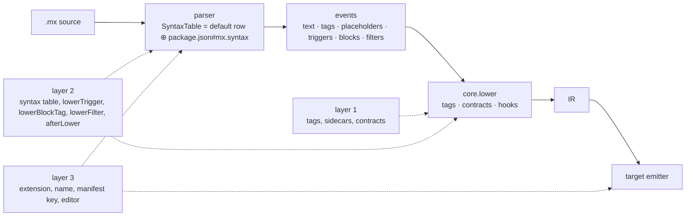

# Language extensions

**Status:** accepted design (decisions 182 to 184, 2026-10-07), not released.
Layers 1 and 2 are planned; layer 3 is an idea kept reachable, not scheduled.

MX is extended at three layers. Each one uses the layer below it and adds
nothing to the parser beyond what the layer below already allows.

| Layer | Who | What changes | Parser involvement | Status |
|---|---|---|---|---|
| [1: tags and contracts](/design-notes/language-extensions/layer-1/) | any project | custom tags, sidecars, contracts, `mx.tags`, `mx.contracts` | none | planned, mostly shipped |
| [2: syntax](/design-notes/language-extensions/layer-2/) | a project, or a package it depends on | delimiters, triggers, block forms, filters; lowering hooks for the forms it adds | a data-only table read once per parse | planned |
| [3: languages](/design-notes/language-extensions/layer-3/) | a language author | packaging: own extension, name, manifest key, editor language, pinned core | none of its own | idea |

The [core](/design-notes/language-extensions/core/) page states what stays
fixed: Marko's grammar on the default row, the intermediate representation,
the event boundary of the parser, and the one runtime shape every host shares
for attribute tags.

## The two rules every layer obeys

**Grammar is parametrized as data, never as code.** Everything a layer may
change about parsing is a value in the syntax table, read once at the start
of a parse. The table holds no functions. Per character the parser does what
it does today, one lookup on a character code; a matcher runs only after its
trigger character hit. A native lexer can take the same table and emit the
same events.

**Hooks run after parsing.** A layer contributes functions only at lowering
(`lowerTrigger`, `lowerBlockTag`, `lowerFilter`, `afterLower`) and, for layer
3, at emit. No parser state waits on a callback.

## What leaves the core

Everything an extension of any layer can express leaves the core, so that
the `.mx` default row is Marko's grammar and nothing else. Atoms and every
name sugar (`:name`, spaced `#id` and `.class`) become layer-2 entries of the
Mesh syntax set. Attribute-tag cardinality from a callee's `Input` type is
dropped for Marko's runtime record with a richer prototype. The
[core](/design-notes/language-extensions/core/) page lists each item with the
Marko behavior it was checked against and the upstream proposal it allows.

## Not a layer: the expression language

Replacing TypeScript inside expressions is a separate dimension a language
may or may not set. It cuts through the expression scanner, the parser behind
it, the binding rewrites, the type projection and every emitter. The table
reserves `expressionLanguage: "ts"` so a second value is additive; nothing
else is designed, because nothing uses it.
